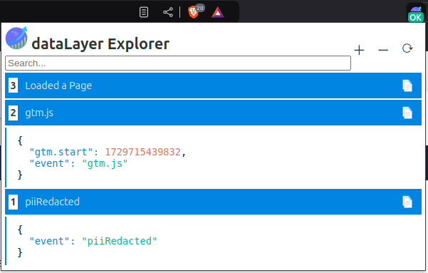

# dataLayer Explorer (coming 26th October 2024)

A browser extension for browsers that support Chrome Extensions.

## License

The code has been licensed under the [MIT](https://opensource.org/license/mit) license.

## Icons

[Application icon by Freepik](https://www.freepik.com/icon/profit_2382603#fromView=family&page=1&position=89&uuid=8883d7b3-8586-4727-a7a4-7fdbe25f53db)

[Google Analytics 4 by gilbarbara](https://www.svgrepo.com/svg/353804/google-analytics)
