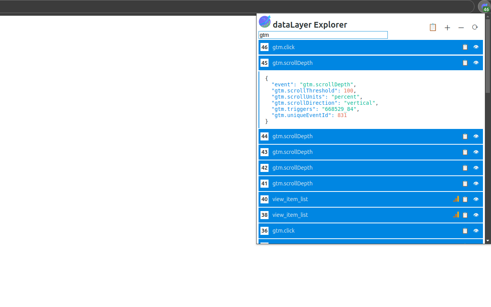
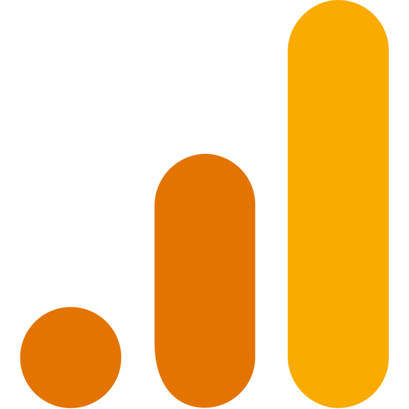

<div align="center">
    <h1>dataLayer Explorer</h1>
    
</div>
<br />

**dataLayer Explorer** is a Chrome extension that helps you monitor and debug analytics tracking on websites. It works with [Google Analytics 4 (GA4)](https://support.google.com/analytics/answer/10089681) and [Matomo](https://matomo.org) by capturing tracking events as they happen on the page.

The extension monitors two key analytics objects:

- `window.dataLayer` - used by Google Analytics 4 and other analytics tools
- `window._mtm` - used by Matomo analytics

All events are displayed in real-time so you can verify your tracking implementation and troubleshoot issues.

<div align="center">
    
</div>

## Features

- **View tracking events** See all analytics events captured on the page. Click any event to expand and view the complete data being sent to your analytics platform.
- **Track multiple pages** Monitor events across multiple browser tabs at once (up to 32 pages). Perfect for testing multi-page user journeys.
- **Identify event sources** Each event shows an icon indicating whether it came from Google Analytics () or Matomo ().
- **Copy event data** Quickly copy event details to share with your team or include in documentation and bug reports.
- **Check event timing** Hover over any event to see exactly when it fired after the page loaded. Useful for understanding the tracking sequence.
- **Search and filter** Find specific events by searching for event names, parameters, or values.
- **Dark mode** Switch between light and dark themes to match your preference.
- **View formats** Choose between JSON format (for developers) or table format (easier to read for non-technical users).
- **Customize settings** Control how many pages to track, choose your preferred view format, and select your theme.
- **Refresh on demand** Update the event list without reloading the page to see the latest tracking activity.
- **Open source** The code is publicly available on GitHub for transparency and community contributions.

## Supported systems

- Events pushed to `window.dataLayer` (e.g. [Google Analytics 4](https://support.google.com/analytics/answer/10089681) and other tools that push to dataLayer).
- Matomo — events pushed to `window._mtm` ([Matomo](https://matomo.org)).

## Installation

- [Chrome Web Store](https://chromewebstore.google.com/detail/datalayer-explorer/akeipgacajnejdmcdmjcilfmhmaejjoe)

## Development

This extension is built with simplicity and transparency in mind. The source code is written in vanilla JavaScript and utilizes Chrome APIs directly, without the use of bundlers or frameworks. This approach ensures that the code you see in the repository is identical to what is deployed to the Chrome Web Store, facilitating easier review, modification, and understanding of the extension's functionality.

- `background.js`: Service worker that updates the browser icon based on whether the page exposes analytics layers. Checks for both `window.dataLayer` and `window._mtm` (Matomo). Also manages extension configuration stored in local storage.
- `popup.html` / `popup.js`: User interface for viewing and interacting with detected analytics events. Includes settings panel for configuring page tracking, format mode, and theme.
- `contentScript.js`: Facilitates communication between `background.js` and `popup.html`. Detects analytics layers and manages multi-page event tracking using localStorage (tracks events per site origin across multiple tabs).
- `init.js`: Injected into the page by `contentScript.js`. Captures events from `window.dataLayer` and `window._mtm` and forwards them to the content script.
- `formatters.js`: Utilities for formatting event data as JSON with syntax highlighting or as column-style tables.
- `utils.js`: Shared utility functions for DOM manipulation, string operations, array/object handling, and time formatting.

### Setup

Install the extension from the [./src](./src) directory as an unpacked extension by following the instructions outlined in [this guide](https://developer.chrome.com/docs/extensions/get-started/tutorial/hello-world#load-unpacked).

### popup.html / popup.js

The extension provides a development server for working on the popup interface. When the `ENVIRONMENT` constant is set to `development` (done automatically by the server), you can work without Chrome APIs using simulated event data that includes examples for both `window.dataLayer` and `window._mtm` (Matomo).

#### Setup

1. Install the supported `Node.js` version using [`nvm`](https://github.com/nvm-sh/nvm).

```bash
nvm install
```

2. Install dependencies.

```bash
npm install
```

3. Start the development server.

```bash
npm run start
```

4. Navigate to:
    - `http://localhost:8100` - Popup development interface
    - `http://localhost:8100/examples` - Example events page

5. Start editing `popup.html` / `popup.js` in the [./src](./src) directory.

## Contributing

If you encounter a bug, please file an issue to report it. Suggestions for improvements are also welcome. You can also contribute directly through a pull request.

## Acknowledgements

- [Application icon by Freepik](https://www.freepik.com/icon/profit_2382603#fromView=family&page=1&position=89&uuid=8883d7b3-8586-4727-a7a4-7fdbe25f53db)
- [Google Analytics 4 (GA4) by gilbarbara](https://www.svgrepo.com/svg/353804/google-analytics)
- [Matomo by SVG Repo](https://www.svgrepo.com/svg/331481/matomo)

## License

The code has been licensed under the [MIT](https://opensource.org/license/mit) license.
